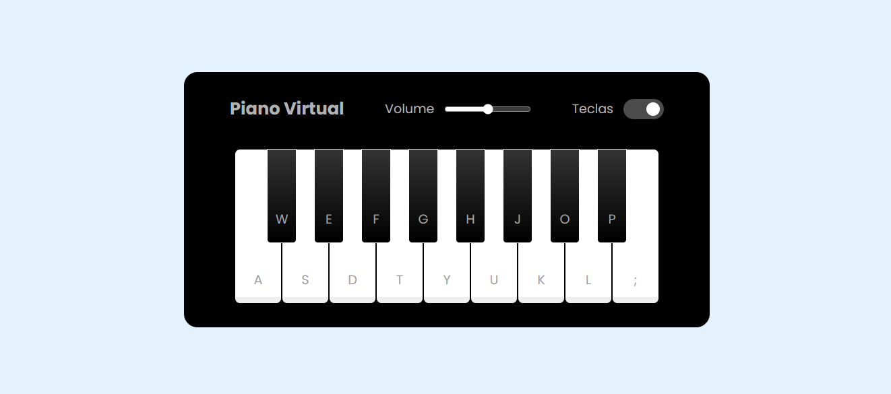

# Piano Simulator 🎹

Simulador interativo de piano desenvolvido em HTML, CSS e JavaScript. Toque de notas, explore acordes e aprenda os fundamentos do piano diretamente no navegador!



## Demonstração

[(Clique aqui para ver o projeto)](https://pianosimulator.vercel.app/)

## Recursos

- Interface de piano virtual responsiva
- Toque de notas via mouse ou teclado do computador
- Sons realistas das teclas
- Visualização de quais teclas estão sendo pressionadas
- Fácil de usar e ideal para iniciantes

## Tecnologias Utilizadas

- **HTML** — Estrutura da página
- **CSS** — Estilização e responsividade
- **JavaScript** — Lógica do funcionamento e interação com o usuário

## Como Usar

1. Clone este repositório:
    ```bash
    git clone https://github.com/ViniciusGCP94/piano-simulator.git
    ```
2. Entre na pasta pelo terminal:
    ```bash
    cd piano-simulator
    ```

3. Abra o arquivo `index.html` no seu navegador.

   
## Contribuição
Pull requests são bem-vindos! Para grandes mudanças, por favor abra uma issue primeiro para discutir o que você gostaria de modificar.

## Licença
Este projeto está licenciado sob a MIT License.
